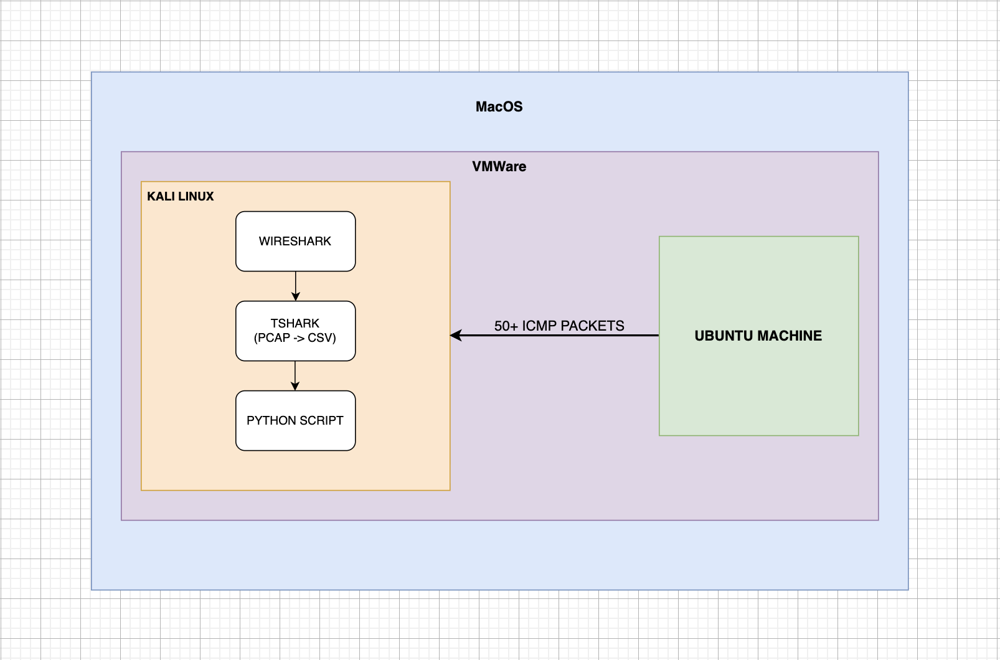
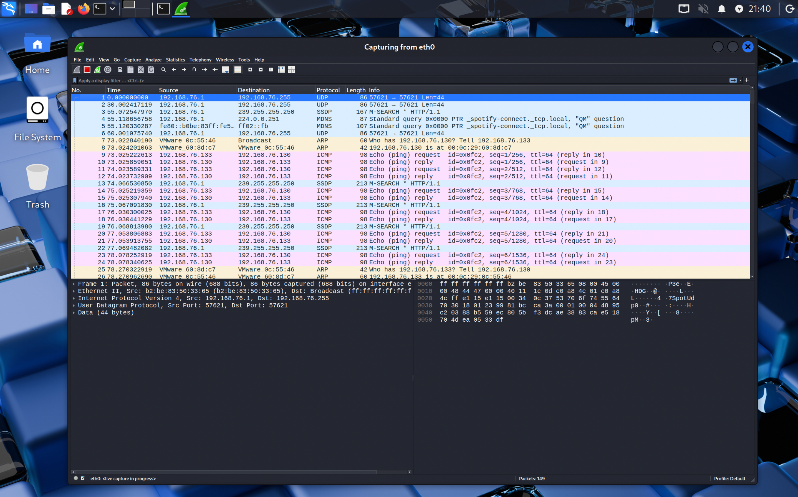

# Automated Network Traffic Analysis using Wireshark, TShark & Python

A hands-on SOC-style home lab project focused on capturing, processing, and analyzing network traffic to detect abnormal ICMP activity using Wireshark, TShark, and Python automation.

This project demonstrates how raw packet captures (PCAPs) can be transformed into actionable security insights using simple detection logic — a core concept in SOC and Blue Team workflows.

⸻

## 📌 Project Overview

- **Environment:** Virtualized Home Lab  
- **Traffic Type:** ICMP (Ping) Burst Traffic  
- **Goal:** Detect high-volume ICMP traffic from a single source IP  
- **Approach:** Capture → Convert → Analyze → Detect

⸻

## 🧱 Lab Architecture

**Components:**

- **Ubuntu VM** – Traffic generation (ICMP burst)
- **Kali Linux VM** – Packet capture & analysis
- **Wireshark** – Live traffic capture
- **TShark** – PCAP to CSV conversion
- **Python** – Automated traffic analysis & detection

### 📷 Architecture Diagram

⸻

## ⚙️ Workflow

1. Generated **50+ ICMP packets** from Ubuntu VM targeting Kali Linux  
2. Captured live traffic on Kali Linux using **Wireshark**  
3. Saved captured traffic as a **PCAP file**  
4. Converted PCAP to **CSV format using TShark CLI**  
5. Analyzed CSV data using a **custom Python script**  
6. Flagged source IPs exceeding a **defined packet threshold**

### 📷 Wireshark Capture

⸻

## 🛠️ Tools & Technologies

- **Operating Systems:** Kali Linux, Ubuntu  
- **Packet Analysis:** Wireshark, TShark  
- **Programming:** Python 3  
- **Concepts:** ICMP, PCAP analysis, SOC monitoring, automation  
- **Environment:** VirtualBox / VMware

⸻

## 🧪 Detection Logic

- Parsed packet-level data from **CSV output**
- Counted number of packets per **source IP address**
- Applied a **threshold-based rule**:
  - Flag any source IP sending **more than 30 packets** as potentially suspicious

### 📷 Python Script (Detection Logic)

⸻

## 📊 Results

- Analyzed **100+ packets** from live traffic captures  
- Successfully identified the ICMP traffic source IP with **100% accuracy**  
- Reduced manual packet inspection effort by **~65%** using automation

### 📷 Script Output / Detection Result

⸻

## 🧠 Key Learnings

- Understanding **ICMP traffic behavior** at the packet level  
- Using **Wireshark & TShark** together for scalable analysis  
- Converting raw **PCAP data into structured datasets**  
- Designing **simple but effective detection logic**  
- Appreciating the importance of **automation in SOC environments**

⸻

## 🚀 Future Improvements

- Add **rate-based detection** using timestamps  
- Support detection of **multiple source IPs**  
- Export alerts to **JSON / CSV format**  
- Extend logic to simulate **DoS / ICMP flood scenarios**
